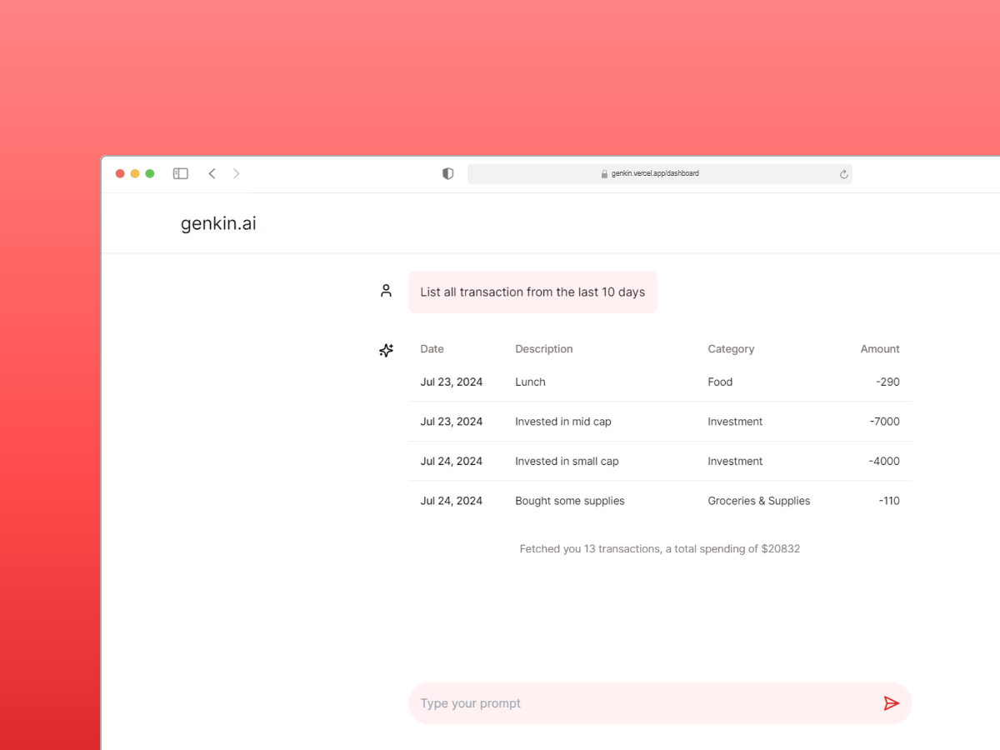

## Genkin - track money using AI

Track your cash flows seamlessly using AI and analyse them

---

<a class="text-center mx-auto" href="">Read the full annoucement</a>

### How does Genkin work?

Genkin uses Gemini Flash 1.5 to give responses to prompts. There are three main pages in Genkin once you sign up using [GitHub](https://github.com/).

1. Chat system to save transactions
2. Analyse your transactions
3. View your saved transactions

#### Chat system

Genkin uses the latest version of Vercel AI sdk to interact with the Google Gemini Flash 1.5 LLM. Vercel AI sdk provides a provision to call certain tools when the modal feels like to. For eg: the prompt _"Invested $10000 in Mid cap funds yesterday"_, will make the model call a certain tool to open up a React server component, before which the model automatically tokenizes the important information for saving the entry faster. This is only available in certain LLMs like Google Gemini.

#### Analysing Transactions

Your saved transactions can be analysed in three ways - by Weekly data, by category, and by inflows and outflows. Genkin automatically assigns a category based in the user prompt. Shadcn.ui Charts is used to beautifully display the data.

### Tech Stack

- Next.js
- Tailwind CSS + Shadcn.ui
- Supabase & Supabase Auth
- Zod and react-hook-forms
- Vercel AI SDK
- Google Gemini Flash 1.5
